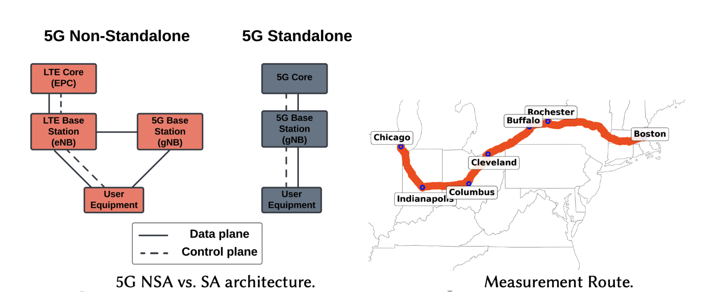

# [CoNEXT '25] A First Large-Scale Study of Operational 5G Standalone Networks

In this repository, we release the dataset and scripts used in the CoNEXT '25
paper, *A First Large-Scale Study of Operational 5G Standalone Networks*.

<p align="center">

</p>

**Authors**:
[[Moinak Ghoshal](https://sites.google.com/view/moinak-ghoshal/home)] 
[[Omar Basit](https://scholar.google.com/citations?user=O8YhcToAAAAJ&hl=en)] 
[[Sizhe Wang](https://sizhewang.cn)]
[[Phuc Dinh](https://scholar.google.com/citations?user=87M0_7EAAAAJ&hl=en)]
[[Imran Khan](https://imranbuet63.github.io)]
[[Yufei Feng](https://www.linkedin.com/in/yufei-feng-7b268820b)]
[[Zhekun Yu](https://www.linkedin.com/in/zhekun-yu-444a962a8/)]
[[Y. Charlie Hu](https://engineering.purdue.edu/~ychu/)]
[[Dimitrios Koutsonikolas](https://ece.northeastern.edu/fac-ece/dkoutsonikolas/)]


---

## Repository Structure & Usage

- **`raw_data/`**  
  Contains the original measurement data in `.xlsx` and `.csv` formats.

- **`scripts/`**  
  The scripts directory contains two types of scripts:
  1. **Process data scripts** — `parse_sa_nsa_perf_data_2023.py` and `parse_sa_nsa_perf_data_2024_lax_bos.py`  
     These scripts use the raw measurement data from the `raw_data/` directory and generate processed pickle (`.pkl`) files, which are stored in the `pkls/` folder.  
  2. **Parse data scripts** — `plot-figures.py` generates all figures presented in the ACM CoNEXT paper using both 2023 and 2024 datasets.  
     Additionally, `tmobile_nsa_sa_boston.py` and `tmobile_nsa_sa_chicago.py` generate plots specific to the head-to-head SA vs. NSA analysis conducted in Boston and Chicago.

- **`pkls/`**  
  Stores intermediate processed data (pickled Python objects).

- **`plots/`**  
  Contains the final parsed/visualized results, including replication figures.

---

## Data Access

Note: Use the following command to download large dataset files stored with Git LFS:
```bash
git lfs pull
```
---
## References

Please cite appropriately if you find the dataset useful.

```bibtex
@article{ghoshal:conext2025,
  title={A First Large-Scale Study of Operational 5G Standalone Networks},
  author={Ghoshal, Moinak and Basit, Omar and Wang, Sizhe and Dinh, Phuc and Khan, Imran and Feng, Yufei and Yu, Zhekun and Hu, Y Charlie and Koutsonikolas, Dimitrios},
  booktitle={In Proceedings of the 21st ACM International Conference on Emerging Networking EXperiments and Technologies},
  year={2025}
}
```

---

If there are any questions, feel free to contact us  
([ghoshal.m@northeastern.edu](mailto:ghoshal.m@northeastern.edu)).
